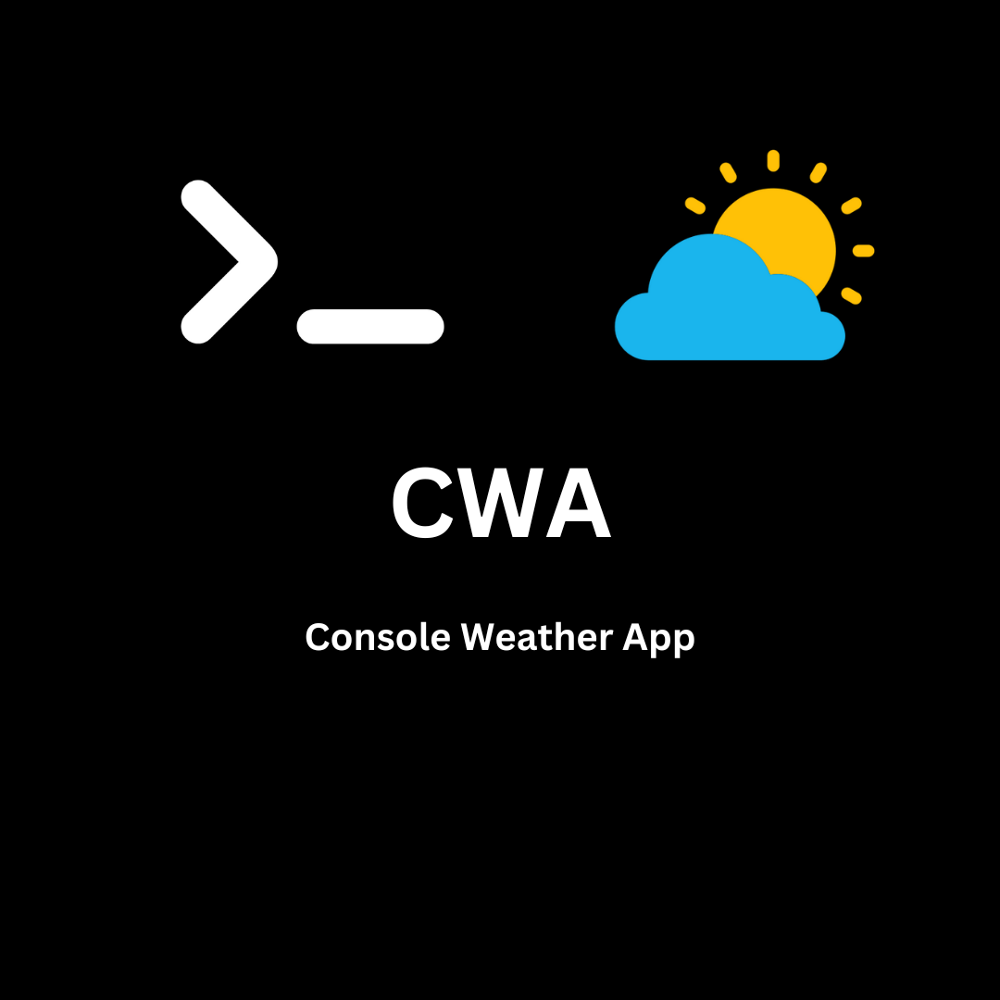

# Console Weather App |  [](https://twitter.com/intent/tweet?text=Get%20over%20170%20free%20design%20blocks%20based%20on%20Bootstrap%204&url=https://www.froala.com/design-blocks&via=froala&hashtags=bootstrap,design,templates,blocks,developers)
 
   [](https://github.com/Degamisu/Console-Weather-App/actions/workflows/build_and_release.yml) 


---

**PROJECT _WILL_ BE HAULTED UNTIL CONTRIBUTIONS RISE**

---



## About

This app is a console based weather app. You can choose between 2 options for location. You can **Specify** the location, or you can automatically find the location based off of **GPS tracking**. This is a very fast and reliable service that is being updated frequently.

## Important Information

This app contains a `secret` code in order to properly function. In some parts of the code, a variable named `{GH_TOKEN}` is created. However, if you use Codespaces, you will need to provide your own `secret` code in order for the scripts to work. (eg, [build_and_release.yml - Github Actions](build_and_release.yml))

---

There is a wiki! you can find this at the `wiki` tab. The tab includes:

- Directory Graph
- Error Codes
- Information
- Dependencies

## Security

Some people get a little worried when they hear "Tracking." This app does not take personal information/location and uploads it anywhere. Your location is contained in the console and only used to gather weather data. Your location is broad, therefore there will be no worries about leaked locations. If this is forked and not committed to the official repository, it may not be safe. Check the repositories code to see if it is safe.

## Sources

This app gets its weather data with:

- Geocoder
- [Open Metro API](https://api.open-meteo.com/v1/forecastP|)

Making this app very fast and reliable.

## Installation (with source AutoInstall)

To make it easier to build, I created a script that does all the building for you. The file is called [AutoInstall](autoinstall.bash). This makes the build process faster, but there are a few disadvantages

- Deletes the Build process source code (generated automatically)
- One set path.

## Installation (with source)

**Notes:**
- This currently only works on Ubuntu Linux. This may change.
- Git must be installed. Install it with [this](InstallGit.bash)
- This is good if you want to _keep_ the build artifacts and mess with a few files.

<details>
<summary>Download Source Code</summary>

To install the source code, run this command in any terminal:

```bash
mkdir Console-Weather-App-Source && cd Console-Weather-App-Source && gh repo clone Degamisu/Console-Weather-App && cd Console-Weather-App
```
This should download the source
</details>
<details>
<summary>Install Dependencies</summary>
This is the install command to install necissary dependencies.

```bash
pip install -r requirements.txt
```

**THIS IS CRUCIAL** to the installation of CWA.
</details>

---
**The next part can be done in 2 ways**

<details>
<summary>Build the executable</summary>

__This requires `pyinstaller` to build, which is installed under the `Install Dependencies` dropdown__

---

To build, run this into your bash console
```bash
pyinstaller --onefile main.py
```

</details>
<details>
<summary>Run directly</summary>
This is the easiest way through, skipping the building part. However, it would be harder to transport.


---

**Python**
```bash
cd dist && python main.py
```

**Python3**
```bash
cd dist && python3 ./main.py
```

</details>

---

This section is optional.

<details>
<summary>Cleanup</summary>

To clean up build artifacts (under /build), run this script:

```bash
rm -r build
```
</details>

---

## Contributing

Have an idea for CWA? Contributing will be open soon. For now, you can open issues!

---

**Is this readme missing something? If so, shoot a pull request! I will review it ASAP!**

© 2024 Degamisu | All Rights Reserved | [README](README.md) Created by **Emi Yamashita**
